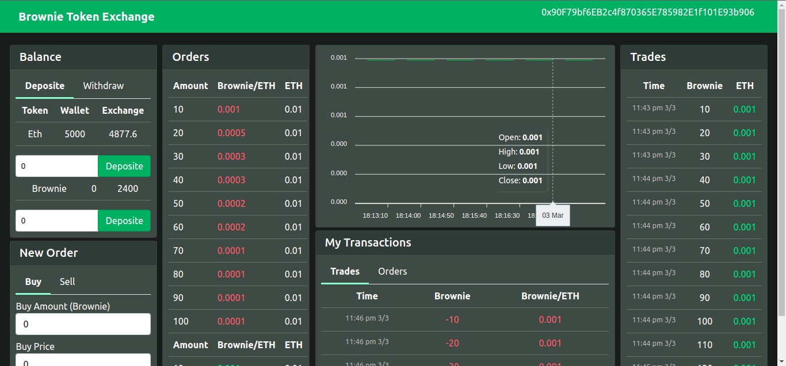

# Token exchange 
By zoubair Hattab
decentralized ERC-20 token (Brownie token ) exchange .



### Tech stack & packages used :man_technologist:
- React.js ,solidity ,hardhat ,mocha, chai, ether.js, web3.js,lodash, apexcharts & waffle
### Token exchange features :
- [x] Deposite & withdraw ether.
- [x] Deposite & withdraw token.
- [x] Buy & sell token.
- [x] Maintain trade (Create order,fill order & cancel order).
- [x] Realtime updates.

### How to run :
----------------
- Run hardhat node
    ```
    npx hardhat node
    ```
- Run test cases
    ```
    npx hardhat test
    ```
- Deploy contract in local hardhat node
    ```
    npx hardhat run scripts/deploy.js --network localhost
    ```
- Connect hardhat with metamask
- Run react frontend
    ```
    cd client
    npm start
    ```